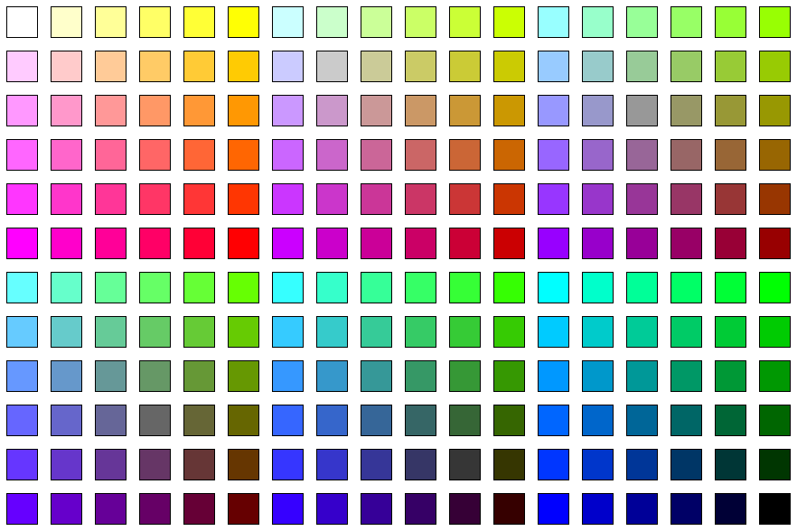

# colors.html
HTML Color Picker (Ctrl+C)

Click on a color chart and copy the hex code.
Using - [clipboard.js](https://github.com/zenorocha/clipboard.js)

This list is having a limited set of colors.

